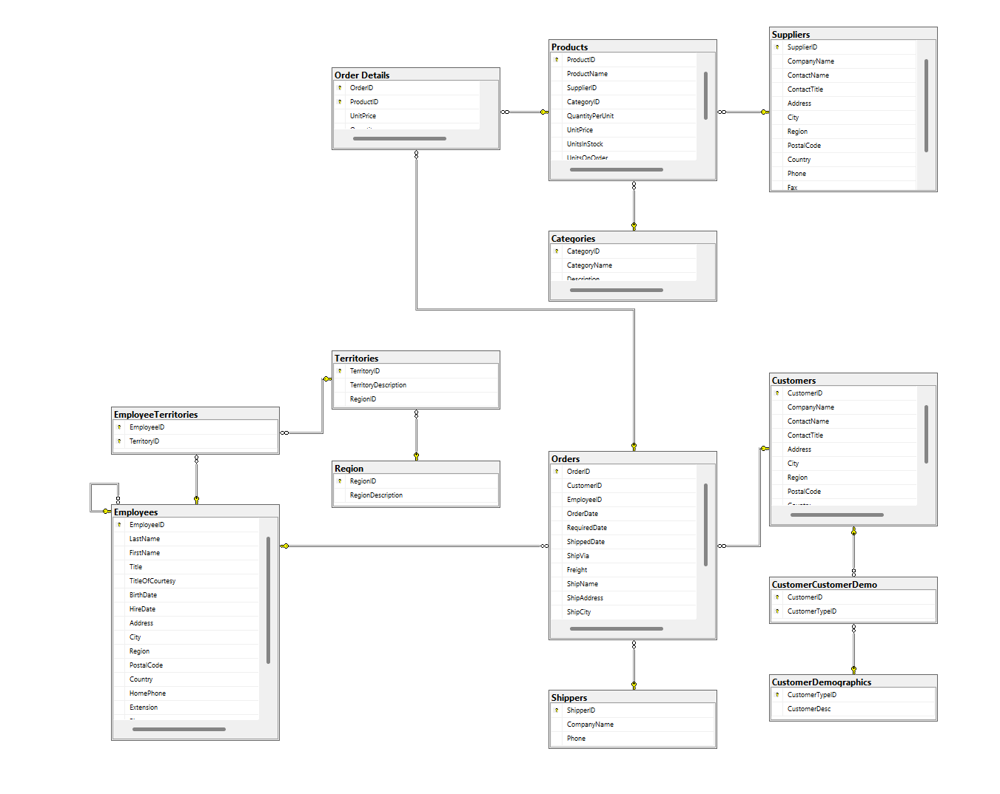

# Sale management system using T-SQL and Northwind Database

## Overview

## Architecture
### Database

## Getting started
### Installation
1. Clone the repository
`git clone https://github.com/notworLe/Sales-Management-System-Using-T-SQL-and-Northwind-Database.git`
2. Installing Docker Deskstop
3. Seed sample data **(optional)**  
Run the following SQL file to populate the database with sample data.  
Click on `instnwnd.sql`, execute this file.
4. 

